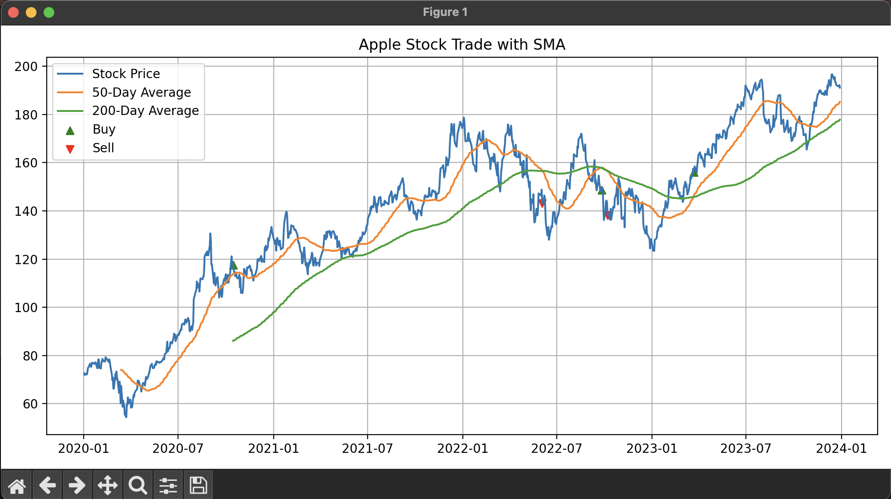

# `Trading Strategy backtest--SMA and Bollinger Bands`
Algorithmic trading is a core part of financial markets used for trading and investing in the Equity and derivative markets with help of 
the concepts of math and well computated strategies.

In this project we have backtested two such popular trading strategies that are as follows:
- `Simple Moving Averages` and,
- `Bollinger-Bands`

`Simple-moving-averages` : 
- This is very popular and commonly used strategy in investing and trading where we take trend indicators into consideration.These indicators are
  bascially defining Long and short positions in the market.

- So when we talk about in case of SMA, we take in the two popular trend indicators--50MA (For short Position) and 200MA (For long position).

- These two MA lines are placed in candlestick chart and the point of intersection between the two when:
    - The 50 MA line is intersecting above the 200 MA-- `Buy Signal`
    - The 50 MA line is intersecting below the 200 MA-- `Sell Signal`

    The following the tested output using Apple historic stock data which is fetched from yahoo finance.

    

`Bollinger Bands` :
- This a popular strategy-- a volatility indicator which helps traders and investors to see the stock's volatility in isolation, that is 
  how far the prices will deviate from the simple moving average line( usually 20 MA). This helps in getting the standard deviation.

- So when we used this indicator, there are lines that we get to see when evaluating a specific stock's movement, they are:
  - We have 3 lines that are plotted on the candlestick chart, Upper band , lower band and the the simple moving average line in between 
    the two bands.
  - When we run the indicator, the stock going above the `SMA` line-- it shows an uptrend.
  - Similarly when the stock goes below the `SMA` line -- it shows a downtrend.
  - When the price touches the upper band-- the stock may be seen as `Overbought`
  - When the price touches the lower band-- the stock may be seen as `Oversold`
  - The bands widen on `increased volatility` of the stock and contracts when there is a `drop` in the volatility. 

  The following the tested output using AMD  historic stock data which is fetched from yahoo finance.

  

--> The Project also consists of backtesting the above two strategies `combined` for the following reason :
  - While bollinger bands may indicate the volaitility of the stock in isolation, the indicator itself can give many `false` `buy` and `sell`
  signals.
  - So Combining them will reduce these false signals and with the SMA crossover as discussed above-- it will reduce the number of false 
  entry and exit positions and also reduce the noise.

  The following the tested output using Apple stock's historic stock data which is fetched from yahoo finance.

  


# Getting started - First steps when you clone the project to run it.

Steps:-

1. Make sure you have a virtual environment folder created for installing the required dependencies for the project:

```bash
python -m venv venv
```

2. After creating the virtual environment folder, activate the folder for the dependencies that are installed in it accessible:

```bash
source venv/bin/activate
```

3. For other dependencies including fastapi, langchain etc, run the following the command:

```bash
pip install -r requirements.txt

```
4. After installing the necessary dependencies-- run the following commands to test the strategies:

-For testing Simple Moving Average strategy:

```bash
python SMA.py

```

-For testing the Bollinger Band strategy:

```bash
python BollingerBands.py
```

-For testing SMA+Bollinger combined:

```bash
python SMA_+_Bollinger.py
